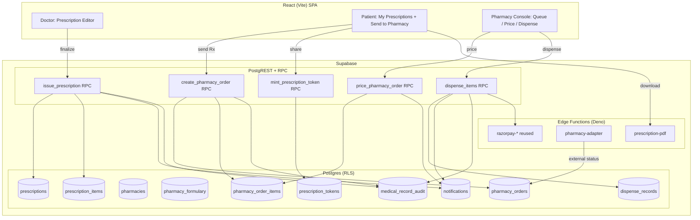

# Design Document: Prescription Management & Pharmacy Integration

## Overview

Today a "prescription" in MediBook is one free-text column (`consultation_notes.prescription`) a doctor types at consultation close. It cannot be parsed, priced, validated, or fulfilled. This feature promotes prescriptions to structured, signed medical records and adds a fulfillment path: a patient can send a prescription to a pharmacy, the pharmacy prices and dispenses it, and every step is authorized by RLS and written to an audit trail.

The design is deliberately layered so it can ship in phases: the **structured prescription** core (Phase 1) delivers value on its own (viewable, downloadable prescriptions) even before any pharmacy exists. Pharmacy onboarding, ordering, and external integration (Phases 2–4) build on top without reworking the core.

It reuses existing MediBook infrastructure everywhere possible: the `appointments`/`consultation_notes`/`doctors`/`profiles`/`hospitals` model, the collaboration onboarding flow for a new PHARMACY role, Razorpay (migration 022) for order payment, the notifications + push stack, the migration-021 medical-record audit pattern, migration-017 advisory-lock/atomic-RPC concurrency, and the MFA/AAL2 gating from the MFA feature for controlled-substance and PHI access.

## Architecture

## Data Models

New tables (all with RLS enabled). Proposed migration files continue the numbered sequence after `034`.

| Table | Purpose | Key columns |
|-------|---------|-------------|
| `prescriptions` | One structured Rx per appointment | `id`, `appointment_id` (unique), `doctor_id`, `patient_id`, `hospital_id`, `status` (DRAFT/ISSUED/CANCELLED/SUPERSEDED), `diagnosis`, `issued_at`, `valid_until`, `cancelled_reason` |
| `prescription_items` | Medication lines | `id`, `prescription_id`, `drug_name`, `form`, `strength`, `dosage`, `frequency`, `duration`, `quantity`, `instructions`, `is_controlled` |
| `pharmacies` | Dispensing entities | `id`, `owner_user_id`, `name`, `license_no`, `address`, `city`, `phone`, `is_active` |
| `pharmacy_formulary` | Per-pharmacy catalog | `id`, `pharmacy_id`, `drug_name`, `form`, `strength`, `price_paise`, `in_stock` |
| `pharmacy_orders` | Fulfillment request | `id`, `prescription_id`, `pharmacy_id`, `patient_id`, `status` (RECEIVED/PRICED/CONFIRMED/READY/DISPENSED/PARTIALLY_DISPENSED/REJECTED/CANCELLED), `total_paise`, `payment_id`, `reject_reason` |
| `pharmacy_order_items` | Priced/substituted lines | `id`, `order_id`, `prescription_item_id`, `unit_price_paise`, `qty_priced`, `qty_dispensed`, `substitute_of`, `available` |
| `dispense_records` | Immutable dispense log | `id`, `order_id`, `prescription_item_id`, `qty`, `dispensed_by`, `dispensed_at` |
| `prescription_tokens` | Scoped share link | `id`, `prescription_id`, `token_hash`, `expires_at`, `revoked_at` |

### Key constraints & invariants
- `prescription_items` finalized (parent `ISSUED`) are immutable — enforced by an RLS/trigger check; edits require a superseding prescription.
- `SUM(dispense_records.qty)` per `prescription_item_id` ≤ `prescription_items.quantity` — enforced inside the `dispense_items` RPC under an advisory lock keyed on `order_id`.
- Controlled items (`is_controlled = true`) may be dispensed at most once and require the prescriber's session at AAL2 to issue.
- Tokens store only a hash (like MFA recovery codes); the plaintext is shown once to the patient.

## Concurrency & Correctness

Follows the migration-017 pattern already used across booking, swap, and queue:
- `dispense_items(order_id, lines[])` takes `pg_advisory_xact_lock(hashtextextended('dispense:'||order_id, 0))`, re-reads current dispensed totals inside the lock, validates against prescribed quantity, then writes `dispense_records` and updates `qty_dispensed` atomically.
- Order status transitions are validated server-side (state machine) so a REJECTED order can't be dispensed, etc.
- All amounts (prices) are read from `pharmacy_formulary`/`pharmacy_order_items` server-side and never trusted from the client — mirroring the Razorpay "amount from DB" rule.

## Security & Compliance

- **RLS scoping:** prescriber → own prescriptions; patient → own; pharmacy → only orders sent to their pharmacy (+ formulary they own); admin → read-only oversight. A pharmacy can read a prescription only via an existing `pharmacy_order` OR a valid `prescription_token`.
- **AAL2 gating:** viewing full Rx detail and issuing/dispensing controlled medications require AAL2, reusing the JWT `aal` claim checks from the MFA migrations (027/028).
- **Audit:** every Rx read, order creation, and dispense writes to `medical_record_audit` (migration 021 pattern): actor, action, target, timestamp.
- **Sanitization:** all free-text (`instructions`, `diagnosis`, reasons) passes through `src/security/sanitize.js` on write.
- **Tokens:** single-prescription, expiring, revocable, hash-stored.
- **External adapter:** `pharmacy-adapter` Edge Function holds provider secrets, validates inbound webhook signatures, and maps external → canonical states; unknown states are no-ops + audit.

## Components and Interfaces

### Frontend Surface

- **Doctor:** replace the free-text field in `ConsultationModal.jsx` with a structured Prescription editor (repeatable item rows), plus a read view in `AppointmentRecordControls.jsx`. Service: `src/services/prescriptions.js`.
- **Patient:** new `src/pages/patient/MyPrescriptions.jsx` — list, detail, download PDF, "Send to pharmacy" / "Share link". Wired into the patient sidebar and reachable from `MyAppointments`.
- **Pharmacy (new role):** `src/pages/pharmacy/` — order queue, pricing screen, dispense screen, formulary manager, plus a `PharmacyLayout` mirroring `HospitalLayout`. Gate via `ProtectedRoute` with role `PHARMACY`.
- **Services:** `prescriptions.js`, `pharmacy.js`, `pharmacyOrders.js` following the existing thin-service-over-RPC pattern.

### Edge Functions

- `prescription-pdf` — renders a verifiable PDF (prescriber, patient, items, issue date, reference + token-verify URL).
- `pharmacy-adapter` — normalized boundary to external pharmacy networks (outbound order push + inbound status webhook, signature-verified).
- Reuse `razorpay-create-order` / `razorpay-verify-payment` / `razorpay-webhook` for order payment (amount sourced from the order total in DB).

### RPC Interfaces (server-side contracts)

| RPC | Caller | Returns | Notes |
|-----|--------|---------|-------|
| `issue_prescription(appointment_id, diagnosis, valid_until, items[])` | Doctor | prescription id | Requires AAL2 if any item controlled; sets status ISSUED |
| `cancel_prescription(prescription_id, reason)` | Doctor | void | Notifies patient |
| `create_pharmacy_order(prescription_id, pharmacy_id)` | Patient | order id | Status RECEIVED |
| `price_pharmacy_order(order_id, lines[])` | Pharmacy | void | Sets PRICED, notifies patient |
| `dispense_items(order_id, lines[])` | Pharmacy | void | Advisory-locked; enforces quantity invariant |
| `mint_prescription_token(prescription_id, ttl)` | Patient | plaintext token (once) | Hash stored |

## Correctness Properties

### Property 1: Quantity conservation
For every `prescription_item`, the sum of `dispense_records.qty` never exceeds `prescription_items.quantity`, under any interleaving of concurrent dispenses.

**Validates: Requirements 4.6, 4.8**

### Property 2: Immutability after issue
Once a prescription is `ISSUED`, its items cannot be edited; only a superseding revision or cancellation is possible.

**Validates: Requirements 1.6**

### Property 3: Single controlled dispense
A controlled item is dispensable exactly once, for exactly its prescribed quantity.

**Validates: Requirements 4.7**

### Property 4: Access minimality
A pharmacy can read a prescription iff it holds a `pharmacy_order` for it or a valid, unexpired, unrevoked `prescription_token`.

**Validates: Requirements 6.6, 2.5**

### Property 5: Amount authority
Order totals are always derived server-side from formulary/order-item prices, never accepted from the client.

**Validates: Requirements 4.2, 4.4**

### Property 6: Valid state transitions
`pharmacy_orders.status` only moves along the defined state machine; terminal states (DISPENSED, REJECTED, CANCELLED) reject further mutation.

**Validates: Requirements 4.5, 4.9**

## Error Handling

- **Validation errors** (missing required item fields, empty prescription, expired validity) → rejected server-side with a specific message before any write.
- **Authorization failures** (wrong role, AAL1 for controlled/PHI, foreign prescription) → RLS/RPC denies with a generic message; details only in server logs (consistent with existing information-disclosure hardening).
- **Concurrency conflicts** (two dispenses racing) → serialized by advisory lock; the losing writer re-reads and either succeeds within remaining quantity or fails with a clear "quantity exceeded" error, never a partial/double write.
- **External adapter failures** → the `pharmacy_order` stays in its last known state; the adapter returns a retryable error and records an audit entry rather than applying a partial update. Inbound webhooks are idempotent (dedupe on external event id).
- **Token misuse** (expired/revoked/wrong prescription) → access denied, audit entry written.

## Phased Delivery Plan

**Phase 1 — Structured prescriptions (no pharmacy).** Migrations for `prescriptions` + `prescription_items`, `issue_prescription` RPC, doctor editor, patient view, `prescription-pdf`, notifications, audit. Ships standalone value.

**Phase 2 — Pharmacy entity + formulary.** PHARMACY role via the collaboration onboarding flow, `pharmacies` + `pharmacy_formulary`, pharmacy console shell + formulary manager, RLS.

**Phase 3 — Ordering & fulfillment.** `pharmacy_orders`/`_items`/`dispense_records`/`prescription_tokens`, the order lifecycle RPCs (`create_pharmacy_order`, `price_pharmacy_order`, `dispense_items`, `mint_prescription_token`), patient send/track UI, pharmacy price/dispense UI, order notifications, Razorpay payment on confirm.

**Phase 4 — External integration.** `pharmacy-adapter` Edge Function, canonical state mapping, webhook signature validation, retry/idempotency.

## Testing Strategy

- **Unit (Vitest):** prescription/quantity validators, order state-machine transitions, token expiry logic — following the existing `src/services/*.test.js` and `src/security/*.test.js` patterns.
- **Concurrency:** dispense double-count test — two concurrent `dispense_items` calls must not exceed prescribed quantity.
- **RLS:** negative tests that a pharmacy cannot read a prescription without an order/token, and a patient cannot read another patient's prescription.
- **Controlled meds:** issuing without AAL2 is rejected; re-dispensing a controlled item is blocked.

## Open Decisions (need product input)

1. **Regulatory scope** — target market/region? Controlled-substance and e-prescription rules vary by jurisdiction and materially affect item fields, signatures, and retention.
2. **Pharmacy sourcing** — in-house/partner pharmacies onboarded on MediBook, an external network via API, or both? Determines how much of Phase 4 is needed.
3. **Payment model** — does MediBook take payment for medication (marketplace) or only route the order and let the pharmacy bill? Affects Razorpay settlement and refunds.
4. **Drug catalog** — free-text drug names vs. a coded catalog (e.g. RxNorm/national formulary) for validation and interaction checks. A coded catalog enables safety features but adds a data dependency.
5. **Delivery vs. pickup** — is home delivery in scope, or pickup-only for v1? Delivery adds address handling, courier status, and logistics.

I recommend confirming decisions 1–2 before starting Phase 1, since they shape the `prescription_items` schema and the `is_controlled` handling.
